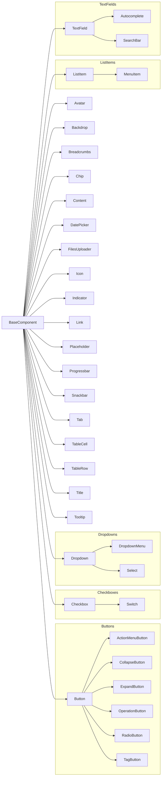

# Page Object Model (POM) in Practice

This document provides practical examples of how to implement the Page Object Model for various UI structures and interactions.

## Base Components

Base components are the foundation of our POM strategy. They are simple, reusable classes that wrap basic UI elements. The primary benefit of using base components is that they generate human-readable descriptions for steps and assertions in test reports. This is achieved by combining the component's type and name, making test results easy to understand.

This section provides examples of how to use the base components found in `src/packages/shared/components/base`.

### Component Inheritance Diagram

This diagram illustrates the inheritance hierarchy of the base components.



### Simple Wrapper Components

These components are simple wrappers around `BaseComponent` that only differ by their `componentType`. They provide semantic meaning and better test reporting but don't add additional functionality:

- **`Avatar`**: Represents a user's avatar
- **`Backdrop`**: Represents a backdrop overlay
- **`Chip`**: Represents a chip element
- **`Content`**: Represents content areas
- **`Icon`**: Represents an icon
- **`Indicator`**: Represents status indicators
- **`Link`**: Represents hyperlinks
- **`Placeholder`**: Represents placeholder content
- **`Progressbar`**: Represents progress indicators
- **`Tab`**: Represents a tab in a tab group. The main locator for a tab is the button that is clicked to open it.
- **`TableCell`**: Represents a cell in a table
- **`TableRow`**: Represents a row in a table
- **`Title`**: Represents title elements
- **`Tooltip`**: Represents tooltip elements

**Example Usage (Avatar):**

POM Implementation (`Header.ts`)

```typescript
import { Avatar } from '@shared/components/base'
// ...
export class Header extends BaseComponent {
  readonly userAvatar = new Avatar(this.rootLocator.getByTestId('UserAvatar'), 'User Avatar')
  // ...
}
```

Test Implementation (`1.2-general.spec.ts`)

```typescript
// ...
await expect.soft(portalPage.header.userAvatar).toBeVisible()
// ...
await portalPage.header.userAvatar.hover()
// ...
```

#### Buttons

- **`Button`**: Standard button component.

  POM Implementation (`Header.ts`)

  ```typescript
  import { Button } from '@shared/components/base'
  // ...
  export class Header extends BaseComponent {
    readonly copyToClipboardBtn = new Button(this.rootLocator.getByTestId('CopyToClipboardButton'), 'Copy to Clipboard')
    // ...
  }
  ```

  Test Implementation (`1.2-general.spec.ts`)

  ```typescript
  // ...
  await portalPage.header.copyToClipboardBtn.click()
  // ...
  ```

- **`RadioButton`**: Radio button component extending `Button`.

- **`ActionMenuButton`**: Represents action menu buttons

- **`CollapseButton`**: Represents collapse/expand buttons

- **`ExpandButton`**: Represents expand buttons

- **`OperationButton`**: Represents operation-specific buttons

- **`TabButton`**: Represents tab buttons (deprecated)

- **`TagButton`**: Represents tag buttons

#### List Items

- **`ListItem`**: Standard list item component.

  POM Implementation (`ServerSelect.ts`)

  ```typescript
  import { Dropdown, ListItem } from '@shared/components/base'
  // ...
  export class ServerSelect extends Dropdown {
    // ...
    getListItem(name?: string): ListItem {
      return new ListItem(this.rootLocator.getByRole('option', { name: name }), name)
    }
  }
  ```

- **`MenuItem`**: Menu item component extending `ListItem` for menu interactions. It is recommended to use `ListItem` for all list item interactions, including menu items, to maintain consistency.

  POM Implementation (`ContextMenu.ts`)

  ```typescript
  import { MenuItem } from '@shared/components/base'
  // ...
  export class ContextMenu extends BaseComponent {
    readonly editItem = new MenuItem(this.rootLocator.getByRole('menuitem', { name: 'Edit' }), 'Edit')
    // ...
  }
  ```

  Test Implementation (`context-menu.spec.ts`)

  ```typescript
  // ...
  await contextMenu.editItem.click()
  // ...
  ```

### Components with Enhanced Functionality

- **`Breadcrumbs`**: For navigation breadcrumb interactions with methods like `clickWorkspaceLink()`, `clickPackageLink()`, and `clickPackageVersionLink()`.

  POM Implementation (`DocumentPreviewPageToolbar.ts`)

  ```typescript
  import { Breadcrumbs } from '@shared/components/base'
  // ...
  export class DocumentPreviewPageToolbar extends BaseComponent {
    readonly breadcrumbs = new Breadcrumbs(this.rootLocator.getByTestId('Breadcrumbs'), 'Breadcrumbs')
    // ...
  }
  ```

  Test Implementation (`5.1-workspace-view.spec.ts`)

  ```typescript
  // ...
  await workspacePage.toolbar.breadcrumbs.clickWorkspaceLink()
  // ...
  ```

- **`Checkbox`**: For checkbox interactions with `check()` and `uncheck()` methods.

  POM Implementation (`OperationListItem.ts`)

  ```typescript
  import { Checkbox, Link } from '@shared/components/base'
  // ...
  export class OperationListItem extends ListItem {
    readonly checkbox = new Checkbox(this.rootLocator.locator('//label'), 'Checkbox')
    // ...
  }
  ```

  Test Implementation (`12.1.1-pkg-man-grouping-crud.spec.ts`)

  ```typescript
  // ...
  await editOperationGroupDialog.leftList.getOperationListItem(toAdd![0].operations[0]).checkbox.click()
  // ...
  ```
- **`Switch`**: For switch/toggle controls.

- **`DatePicker`**: For date selection with additional elements and methods.

  POM Implementation (`Filters.ts`)

  ```typescript
  import { DatePicker, Select } from '@shared/components/base'
  // ...
  export class Filters extends BaseComponent {
    // ...
    readonly datePicker = new DatePicker(this.rootLocator.getByTestId('DatePicker'), 'Date Picker')
    // ...
  }
  ```

  Test Implementation (`2-global-search.spec.ts`)

  ```typescript
  // ...
  await globalSearchPanel.filters.datePicker.click()
  await globalSearchPanel.filters.datePicker.dateCell(today).click()
  // ...
  ```

- **`FilesUploader`**: For file upload operations with `setInputFiles()` method.

  POM Implementation (`ConfigureVersionTab.ts`)

  ```typescript
  import { FilesUploader } from '@shared/components/base'
  // ...
  export class ConfigureVersionTab extends Tab {
    readonly filesUploader = new FilesUploader(this.page.getByTestId('FileUpload'), 'Configure Version')
    // ...
  }
  ```

  Test Implementation (`4.3.2-package-editing-publishing.spec.ts`)

  ```typescript
  // ...
  await configureVersionTab.filesUploader.setInputFiles([
    FILE_P_PETSTORE20,
    FILE_P_PETSTORE31,
    FILE_P_GQL_SMALL,
    FILE_P_JSON_SCHEMA_JSON,
    FILE_P_JSON_SCHEMA_YAML,
    FILE_P_MSOFFICE,
    FILE_P_MARKDOWN,
    FILE_P_PICTURE,
    FILE_P_ARCHIVE,
  ])
  // ...
  ```

- **`Snackbar`**: Represents a snackbar notification with additional elements.

  POM Implementation (`PortalPage.ts`)

  ```typescript
  import { Snackbar } from '@shared/components/base'
  // ...
  export class PortalPage extends BasePage {
    // ...
    readonly snackbar = new Snackbar(this.page)
  }
  ```

  Test Implementation (`1.2-general.spec.ts`)

  ```typescript
  // ...
  await portalPage.header.copyToClipboardBtn.click()
  await expect(portalPage.snackbar.getSnackbar('success')).toContainText('Link was copied to clipboard')
  // ...
  ```

#### Dropdowns

- **`Dropdown`**: Base dropdown component with abstract `getListItem` method.

  POM Implementation (`ServerSelect.ts`)

  ```typescript
  import { Dropdown, ListItem } from '@shared/components/base'
  // ...
  export class ServerSelect extends Dropdown {
    // ...
    getListItem(name?: string): ListItem
    getListItem(nth: number): ListItem
    getListItem(nameOrNth?: string | number): ListItem {
      if (typeof nameOrNth === 'string') {
        return new ListItem(this.rootLocator.getByRole('option', { name: nameOrNth }), nameOrNth)
      }
      if (typeof nameOrNth === 'number') {
        return new ListItem(
          this.rootLocator.getByRole('option').nth(nameOrNth - 1),
          `${nameOrNth}${nthPostfix(nameOrNth)} list item`,
        )
      }
      return new ListItem(this.rootLocator.getByRole('option'), 'List Item')
    }
  }
  ```

- **`DropdownMenu`**: Dropdown component extending `Dropdown` with menu item selection functionality.

  POM Implementation (`VersionToolbar.ts`)

  ```typescript
  import { DropdownMenu } from '@shared/components/base'
  // ...
  export class VersionToolbar extends BaseComponent {
    readonly actionsMenu = new DropdownMenu(this.rootLocator.getByTestId('ActionsMenu'), 'Actions Menu')
    // ...
  }
  ```

  Test Implementation (`version-actions.spec.ts`)

  ```typescript
  // ...
  await versionToolbar.actionsMenu.click()
  await versionToolbar.actionsMenu.getListItem('Export').click()
  // ...
  ```

- **`Select`**: Select dropdown component extending `Dropdown` with option selection functionality.

  POM Implementation (`FilterPanel.ts`)

  ```typescript
  import { Select } from '@shared/components/base'
  // ...
  export class FilterPanel extends BaseComponent {
    readonly statusSelect = new Select(this.rootLocator.getByTestId('StatusSelect'), 'Status')
    // ...
  }
  ```

  Test Implementation (`filtering.spec.ts`)

  ```typescript
  // ...
  await filterPanel.statusSelect.click()
  await filterPanel.statusSelect.getListItem('Active').click()
  // ...
  ```

#### Text Fields

- **`TextField`**: Text input component with enhanced functionality including `fill()`, `clear()` methods and `errorMsg` element.

  POM Implementation (`CreateUpdateOperationGroupDialog.ts`)

  ```typescript
  import { TextField } from '@shared/components/base'
  // ...
  export class CreateUpdateOperationGroupDialog extends BaseComponent {
    readonly nameField = new TextField(this.rootLocator.getByTestId('NameField'), 'Name')
    // ...
  }
  ```

  Test Implementation (`12.1.1-pkg-man-grouping-crud.spec.ts`)

  ```typescript
  // ...
  await createOperationGroupDialog.nameField.fill(operationGroup.name)
  await expect(createOperationGroupDialog.nameField.errorMsg).toContainText('Name is required')
  // ...
  ```

- **`Autocomplete`**: Text input with dropdown suggestions, extending `TextField` with additional methods.

  POM Implementation (`LabelsAutocomplete.ts`)

  ```typescript
  import { Autocomplete } from '@shared/components/base'
  // ...
  export class LabelsAutocomplete extends BaseComponent {
    readonly labelsAc = new Autocomplete(this.rootLocator.getByTestId('LabelsAutocomplete'), 'Labels')
    // ...
  }
  ```

  Test Implementation (`14.1-copying-package-version.spec.ts`)

  ```typescript
  // ...
  await copyVersionDialog.labelsAc.set(['label1', 'label2'])
  await expect(copyVersionDialog.labelsAc.getChip('label1')).toBeVisible()
  // ...
  ```

- **`SearchBar`**: A specialized text field for search functionality, often including a search button and clear button.

## Custom Components

Custom components are built from base components and often contain business logic specific to a particular feature or application area.

### Custom Dialogs

Dialogs are crucial for user interactions such as creating, updating, or deleting items. To ensure consistency and reusability, we have a set of base dialog components located in `src/packages/shared/components/custom/dialogs`.

These base dialogs provide common functionality, such as handling titles, buttons (e.g., "Save," "Cancel," "Delete"), and content areas. When creating a new dialog, you should extend one of these base dialogs to inherit its core features.

Here is a list of the available base dialogs:

- **`BaseDialog`**: The most fundamental dialog component, providing the basic structure for all other dialogs.
- **`BaseAddDialog`**: A dialog for adding new items.
- **`BaseCancelDialog`**: A dialog that includes a "Cancel" button and related logic.
- **`BaseCreateDialog`**: A specialized dialog for creating new entities, often including a "Create" button.
- **`BaseDeleteDialog`**: A confirmation dialog for deleting items, typically with a "Delete" button.
- **`BaseImportDialog`**: A dialog for importing data or files.
- **`BasePublishDialog`**: A dialog for publishing content or versions.
- **`BaseRemoveDialog`**: A dialog for removing items from a list or collection.
- **`BaseSaveDialog`**: A dialog that includes a "Save" button for persisting changes.

POM Implementation (`CreateUpdateOperationGroupDialog.ts`)

This example shows how `BaseCreateDialog` is extended to create a dialog for managing operation groups. It includes custom fields and logic while reusing the base dialog's structure. If a dialog has input fields, it should have a default `fillForm` method.

```typescript
import { type Page, test as report } from '@playwright/test'
import { ApiTypeAutocomplete } from '@portal/components'
import { getDownloadedFile } from '@services/utils'
import { Button, FilesUploader, Icon, TextField } from '@shared/components/base'
import { BaseCreateDialog } from '@shared/components/custom'
import {
  type DownloadedTestFile,
  GRAPHQL_API_TYPE,
  type OperationsApiType,
  REST_API_TYPE,
  type TestFile,
} from '@shared/entities'
import {
  DownloadableFilePreview,
  NotDownloadableFilePreview,
} from './CreateUpdateOperationGroupDialog/UploadedFilePreview'

export class CreateUpdateOperationGroupDialog extends BaseCreateDialog {
  readonly groupNameTxtFld = new TextField(this.rootLocator.getByTestId('GroupNameTextField'), 'Group Name')
  readonly apiTypeAc = new ApiTypeAutocomplete(this.rootLocator)
  readonly descriptionTxtFld = new TextField(this.rootLocator.getByTestId('DescriptionTextField'), 'Description')
  readonly additionalOptionsBtn = new Button(this.rootLocator.getByTestId('AdditionalOptionsButton'), 'Additional Options')
  readonly infoIcon = new Icon(this.rootLocator.getByTestId('InfoIcon'), 'Info')
  readonly filesUploader = new FilesUploader(this.rootLocator.getByTestId('UploadButtonInput'), 'OAS Template')
  readonly browseBtn = new Button(this.rootLocator.getByTestId('BrowseButton'), 'Browse')
  readonly downloadableFilePreview = new DownloadableFilePreview(this.rootLocator)
  readonly notDownloadableFilePreview = new NotDownloadableFilePreview(this.rootLocator)
  readonly updateBtn = new Button(this.rootLocator.getByTestId('UpdateButton'), 'Update')

  constructor(page: Page) {
    super(page)
  }

  async fillForm(
    params: Partial<{
      groupName: string
      apiType: OperationsApiType
      description: string
      template: TestFile
    }>,
  ): Promise<void> {
    params.groupName && await this.groupNameTxtFld.fill(params.groupName)
    if (params.apiType) {
      await this.apiTypeAc.click()
      switch (params.apiType) {
        case REST_API_TYPE: {
          await this.apiTypeAc.restApiItm.click()
          break
        }
        case GRAPHQL_API_TYPE: {
          await this.apiTypeAc.graphQlItm.click()
          break
        }
      }
    }
    params.description && await this.descriptionTxtFld.fill(params.description)
    if (params.template) {
      await this.filesUploader.setInputFiles({ name: params.template.name, path: params.template.path })
    }
  }

  async downloadTemplate(): Promise<DownloadedTestFile> {
    let file!: DownloadedTestFile
    await report.step('Download OAS Template file', async () => {
      const downloadPromise = this.page.waitForEvent('download')
      await this.downloadableFilePreview.fileName.click()
      const download = await downloadPromise
      file = await getDownloadedFile(download)
    })
    return file
  }
}
```

### Components with lists

The previous approach of using function overloads for each component to get items from a list is outdated and leads to code duplication. Instead, a new factory function `createItemGetter` should be used.

This utility function creates a getter that can retrieve items from any list (tables, simple lists, etc.) by various criteria (e.g., by name, by index) and provides consistent logging and error handling.

#### Example of an **outdated and deprecated** approach (do not use)

`OverviewGroupsTab.ts`

```typescript
import type { Locator } from '@playwright/test'
import { nthPostfix } from '@services/utils'
import { Button, Tab } from '@shared/components/base'
import { BaseDeleteDialog } from '@shared/components/custom'
import { CreateUpdateOperationGroupDialog } from './OverviewGroupsTab/CreateUpdateOperationGroupDialog'
import { EditOperationGroupDialog } from './OverviewGroupsTab/EditOperationGroupDialog'
import { OverviewGroupRow } from './OverviewGroupsTab/OverviewGroupRow'

export class OverviewGroupsTab extends Tab {
  readonly createGroupBtn = new Button(this.rootLocator.getByTestId('CreateGroupButton'), 'Create Group')
  readonly createUpdateOperationGroupDialog = new CreateUpdateOperationGroupDialog(this.page)
  readonly deleteOperationGroupDialog = new BaseDeleteDialog(this.page)
  readonly editOperationGroupDialog = new EditOperationGroupDialog(this.page)

  constructor(readonly rootLocator: Locator) {
    super(rootLocator.getByTestId('OperationGroupsButton'), 'Groups')
  }

  getGroupRow(groupName?: string, options?: { exact: boolean }): OverviewGroupRow
  getGroupRow(nth?: number): OverviewGroupRow
  getGroupRow(groupName?: string, options?: { exact: boolean }, nth?: number): OverviewGroupRow
  getGroupRow(groupNameOrNth?: string | number, options = { exact: false }, nth?: number): OverviewGroupRow {
    if (typeof groupNameOrNth === 'string' && !nth) {
      return new OverviewGroupRow(
        this.rootLocator.getByRole('cell', { name: groupNameOrNth, ...options }).locator('..'),
        groupNameOrNth,
      )
    }
    if (typeof groupNameOrNth === 'number') {
      return new OverviewGroupRow(
        this.rootLocator.getByTestId('Cell-group-name').nth(groupNameOrNth - 1).locator('..'),
        '',
        `${groupNameOrNth}${nthPostfix(groupNameOrNth)} group row`,
      )
    }
    if (!groupNameOrNth && !nth) {
      return new OverviewGroupRow(this.rootLocator.getByTestId('Cell-group-name').locator('..'))
    }
    if (groupNameOrNth && nth) {
      return new OverviewGroupRow(
        this.rootLocator.getByRole('cell', { name: groupNameOrNth, ...options }).locator('..').nth(nth - 1),
        groupNameOrNth,
        `${nth}${nthPostfix(nth)} group row`,
      )
    }
    throw new Error('Check arguments')
  }
}
```

#### Example of a component with a table

`RulesetManagementTab.ts`

```typescript
import type { Page } from '@playwright/test'
import { createItemGetter, type ItemGetterConfig } from '@services/utils'
import { Button, Select, Tab, Title } from '@shared/components/base'
import { BaseDeleteDialog } from '@shared/components/custom'
import { ActivateRulesetDialog } from './ActivateRulesetDialog'
import { CreateRulesetDialog } from './CreateRulesetDialog'
import { RulesetTableRow } from './RulesetTableRow/RulesetTableRow'

export class RulesetManagementTab extends Tab {
  readonly title = new Title(this.page.getByTestId('CardHeaderTitle'), 'API Quality Ruleset Management')
  readonly rulesetTypeSlt = new Select(this.page.getByTestId('RulesetTypeSelect'), 'Ruleset API Type')
  readonly addRulesetBtn = new Button(this.page.getByTestId('AddRulesetButton'), 'Add Ruleset')

  readonly createRulesetDialog = new CreateRulesetDialog(this.page)
  readonly activateRulesetDialog = new ActivateRulesetDialog(this.page)
  readonly deleteRulesetDialog = new BaseDeleteDialog(this.page)

  private readonly rulesetRowConfig: ItemGetterConfig<RulesetTableRow> = {
    constructor: (locator, componentName, componentType) => new RulesetTableRow(locator, componentName, componentType),
    rootLocator: this.page.getByTestId('Cell-ruleset-name'),
    navigateToParent: true,
    componentTypes: {
      singular: 'ruleset row',
      plural: 'ruleset rows',
    },
  }

  readonly getRulesetRow = createItemGetter(this.rulesetRowConfig)

  constructor(protected readonly page: Page) {
    super(page.getByTestId('RulesetManagementTabButton'), 'API Quality Ruleset Management')
  }
}
```

#### Example of a component with a simple list

`ActivationHistoryTooltip.ts`

```typescript
import type { Page } from '@playwright/test'
import { createItemGetter, type ItemGetterConfig } from '@services/utils'
import { BaseComponent, Title, Tooltip } from '@shared/components/base'

export class ActivationHistoryTooltip extends Tooltip {
  readonly title = new Title(
    this.rootLocator.getByTestId('ActivationHistoryTooltipTitle'),
    'Activation History tooltip',
  )

  private readonly activationRecordConfig: ItemGetterConfig<BaseComponent> = {
    constructor: (locator, componentName, componentType) => new BaseComponent(locator, componentName, componentType),
    rootLocator: this.rootLocator.getByTestId('ActivationHistoryTooltipRecord'),
    componentTypes: {
      singular: 'activation record',
      plural: 'activation records',
    },
  }

  readonly getActivationRecord = createItemGetter(this.activationRecordConfig)

  constructor(protected readonly page: Page, componentName?: string) {
    super(page.getByRole('tooltip'), componentName, 'activation history tooltip')
  }
}
```

#### Filtering by Child Element Text

When a container element contains multiple text elements (e.g., chips, badges, labels) and you need to filter by a specific child element's text rather than the entire container's text, use the `navigateToParent` option with a `rootLocator` pointing to the child element.

**Example:** A validation ruleset container contains a name link, API type chip, and status chip. Filtering by the container's text would match all three elements, making exact matching impossible. Instead, filter by the name link's text:

`QualityValidationSection.ts`

```typescript
import type { Locator } from '@playwright/test'
import { createItemGetter, type ItemGetterConfig } from '@services/utils'
import { Content, Icon, Link, Placeholder, Title } from '@shared/components/base'
import { ValidationRuleset } from './QualityValidationSection/ValidationRuleset'

export class QualityValidationSection {
  // ... other properties ...

  private readonly validationRulesetConfig: ItemGetterConfig<ValidationRuleset> = {
    constructor: ValidationRuleset,
    // Use the name link as rootLocator and navigate to parent container after filtering
    // This allows filtering by the link's text instead of the entire container's text
    // (which includes API type and status chips)
    rootLocator: this.rootLocator.getByTestId('ValidationRulesetContainer').getByTestId('ValidationRulesetLinkName'),
    navigateToParent: true,
    componentTypes: {
      singular: 'validation ruleset',
      plural: 'validation rulesets',
    },
  }

  readonly getValidationRuleset = createItemGetter(this.validationRulesetConfig)

  constructor(private readonly rootLocator: Locator) {}
}
```

**When to use this pattern:**

- The container contains multiple text elements (chips, badges, labels, etc.)
- You need to filter by a specific child element's text
- Exact text matching fails because the container's text includes other elements

**How it works:**

By setting `rootLocator` to the child element (e.g., the name link) and `navigateToParent: true`, `createItemGetter` filters by the child element's text, then navigates back to the parent container. This ensures that filtering is done by the child element's text, not the container's combined text.

### TableRow with Action Buttons

If a `TableRow` contains action buttons, they should be included as properties in the `TableRow` component.

`OverviewGroupRow.ts`

```typescript
import type { Locator } from '@playwright/test'
import { Button, TableCell, TableRow } from '@shared/components/base'
import { test as report } from 'playwright/test'
import { GroupNameCell } from './OverviewGroupRow/GroupNameCell'

export class OverviewGroupRow extends TableRow {
  readonly nameCell = new GroupNameCell(this.mainLocator, this.componentName)
  readonly groupTypeCell = new TableCell(this.mainLocator.getByTestId('Cell-group-type'), this.componentName, 'group type cell')
  readonly descriptionCell = new TableCell(this.mainLocator.getByTestId('Cell-description'), this.componentName, 'description cell')
  readonly apiTypeCell = new TableCell(this.mainLocator.getByTestId('Cell-api-type'), this.componentName, 'API type cell')
  readonly operationsNumberCell = new TableCell(this.mainLocator.getByTestId('Cell-operations-number'), this.componentName, 'operations number cell')
  readonly addBtn = new Button(this.mainLocator.getByTestId('AddButton'), this.componentName, 'add button')
  readonly editBtn = new Button(this.mainLocator.getByTestId('EditButton'), this.componentName, 'edit button')
  readonly exportBtn = new Button(this.mainLocator.getByTestId('ExportButton'), this.componentName, 'export button')
  readonly deleteBtn = new Button(this.mainLocator.getByTestId('DeleteButton'), this.componentName, 'delete button')

  constructor(rootLocator: Locator, componentName?: string, componentType?: string) {
    super(rootLocator, componentName, componentType || 'group row')
  }

  async openEditGroupDialog(): Promise<void> {
    await report.step(`Open "Edit group" dialog for the "${this.componentName}" group`, async () => {
      await this.hover()
      await this.addBtn.click()
    })
  }

  async openEditGroupParametersDialog(): Promise<void> {
    await report.step(`Open "Edit group parameters" dialog for the "${this.componentName}" group`, async () => {
      await this.hover()
      await this.editBtn.click()
    })
  }

  async openExportDialog(): Promise<void> {
    await report.step(`Open "Export settings" dialog for the "${this.componentName}" group`, async () => {
      await this.hover()
      await this.exportBtn.click()
    })
  }

  async openDeleteGroupDialog(): Promise<void> {
    await report.step(`Open "Delete group" dialog for the "${this.componentName}" group`, async () => {
      await this.hover()
      await this.deleteBtn.click()
    })
  }
}
```

### File Downloads

File downloads can be handled by waiting for the `download` event.

POM Implementation (`CreateUpdateOperationGroupDialog.ts`)

```typescript
export class DownloadTab extends BaseSettingsTab {
  // ... existing code ...
  async downloadTemplate(): Promise<DownloadedTestFile> {
    let file!: DownloadedTestFile
    await report.step('Download OAS Template file', async () => {
      const downloadPromise = this.page.waitForEvent('download')
      await this.downloadableFilePreview.fileName.click()
      const download = await downloadPromise
      file = await getDownloadedFile(download)
    })
    return file
    // ... existing code ...
  }
}
```

Test Implementation (`12.1.1-pkg-man-grouping-crud.spec.ts`)

```typescript
const file = await updateDialog.downloadTemplate()
await expectFile(file).toHaveName(OGR_PMGR_CHANGE_DESCRIPTION_N.template!.name)
await expectFile(file).toHaveContent(OGR_PMGR_CHANGE_DESCRIPTION_N.template!.content)
```

### Clipboard Interactions

Clipboard interactions are handled using Playwright's `page.evaluate` method to access the browser's clipboard API.

POM Implementation (`AccessTokensTab.ts`)

```typescript
import { type Page, test as report } from '@playwright/test'
// ... existing code ...

export class AccessTokensTab extends BaseSettingsTab {
  // ... existing code ...

  async copyToken(): Promise<string> {
    let str = ''
    await this.tokenValueTxtFld.copyBtn.click()
    await report.step('Get token from the clipboard', async () => {
      await this.page.waitForTimeout(2000)
      str = await this.page.evaluate(async () => {
        return await navigator.clipboard.readText()
      })
    })
    return str
  }
}
```

Test Implementation (`3.0-general.spec.ts`)

```typescript
// ... existing code ...
await test.step('Copy token', async () => {
  const token = await accessTokensTab.copyToken()

  await expect(portalPage.snackbar).toContainText('Access token copied')
  await expectText(token).toMatch(/[a-z0-9]+/)
})
// ... existing code ...
```
